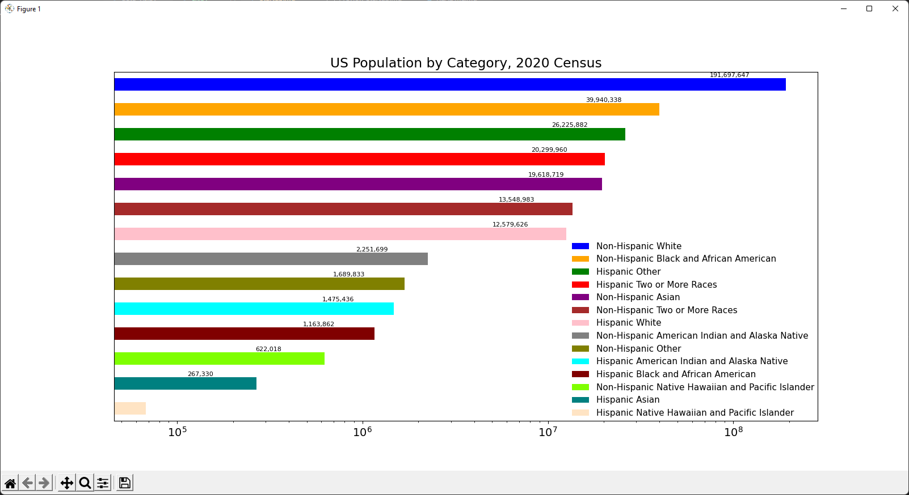
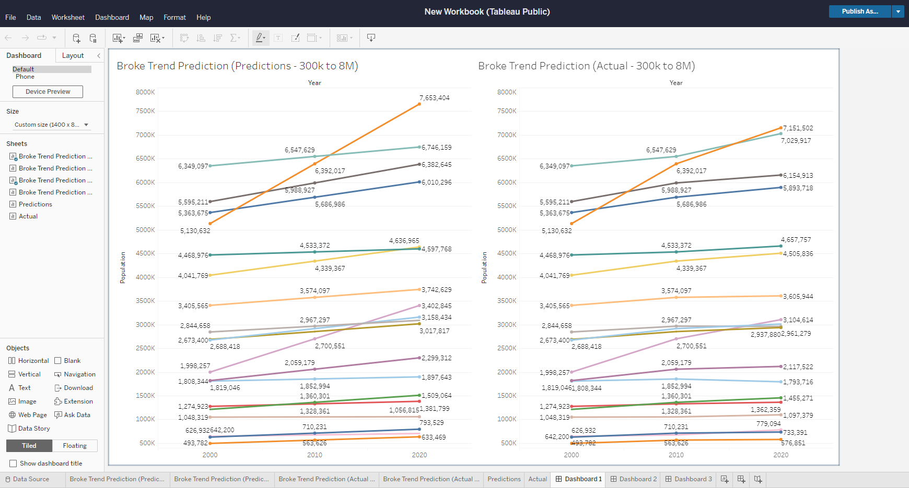

# US Census Redistricting Data Analysis 
Analyzation of US redistricting data for the years 2000, 2010 and 2020

## Table of Contents
* [General Info](#general-information)
* [Technologies Used](#technologies-used)
* [Features](#features)
* [Setup](#setup)
* [Usage](#usage)
    - [Data Ingestion](#data-ingestion)
    - [Data Analysis](#data-querying-and-visualization)
<!--* [Screenshots](#screenshots)
* [Room for Improvement](#room-for-improvement)
* [Contact](#contact) -->


## General Information
The goal of this project is to gather insights and aggregates from redistricting data provided by the [US Census website](https://www.census.gov/data.html). This was achieved with the following steps.

1. Programmatically scrape all relevant data files from 3 (one for each decade from 2000) webpages
2. Unzip and remodel data to include only necessary information
3. Upload new data files into AWS S3 cloud storage
4. Gather the following insights by querying/aggregating data from S3:

    * Which region is the most densely populated?
    * What are the populations for different race/ethnicities present in the United States?
    * Total population of the United States in the given years
    * Which regions are growing the fastest?
    * Which states have the highest rate of growth?
    * Are any states decreasing in population?

<!-- - Why did you undertake it? -->
<!-- You don't have to answer all the questions - just the ones relevant to your project. -->


## Technologies Used
- Python - 3.10.5
    * pandas
    * matplotlib
- AWS S3
- pySpark
- Tableau Public


<!-- ## Screenshots
 -->
<!-- If you have screenshots you'd like to share, include them here. -->


## Setup
<!-- What are the project requirements/dependencies? Where are they listed? A requirements.txt or a Pipfile.lock file perhaps? Where is it located?

Proceed to describe how to install / setup one's local environment / get started with the project. -->
To run the program, clone or copy project folder onto local machine. Then:

Installing packages:
```
pip install boto3
pip install python-dotenv
pip install zipfile

# For data visualization in Python
pip install pandas
pip install matplotlib
```

## Usage
### Data Ingestion
#### Web Scraping for Downloading Zip Files
```
os.system('wget --no-directories --content-disposition -e robots=off -A.zip -r --no-parent -l 3 https://www2.census.gov/census_2000/datasets/redistricting_file_--p1_94-171/')
```
  * ```wget``` is the optimal way to download files recursively on a webpage, bypassing all html elements and text.
    
  * ```--no directories``` keeps recurisve file downloading from creating a hierachy of directories. All files will get saved to the current directory. 

  * ```--content-disposition``` uses the server's suggested name for file naming as opposed to using the tail end of the URL.

  * ```-A.zip``` only allows .zip files to be downloaded

  * ```-r``` downloads recursively

  * ```no-parent``` restricts retrieval of links that refer to a hierarchy above the current directory

  * ``` -l 3``` restricts directory depth of files to be downloaded 

#### Unzipping, Extracting and Uploading Files to S3

```zipfile``` allows for the quick unzipping of zip files in python. The package was used to unzip every zip file downloaded from the ```wget``` command, while providing access to the ```namelist()``` function which returns to us an iterable datatype containing the names of files in a .zip. Then the ```.open``` function was used iteratively to access these files, followed by writing the needed data into a csv file. 

```python
    for filename in sorted(os.listdir(directory)):
        if "usa" in filename:
            pass
        elif "00001" in filename:
            f = os.path.join(directory, filename)
            root =  zipfile.ZipFile(f, "r")
            for name in root.namelist():
                print(name)
                with open(fname1, "a") as y:
                    y.write(root.open(name).readline().decode("utf-8"))
                root.close()
```

After writing the necessary data into a csv file, the ```boto3``` package was implemented to access AWS S3 storage. An instance of boto3's ```Session``` class provides authentication and connectivity to a specific S3 bucket (client, resource). To upload a csv file, ```upload_file()``` was used.

```python
    def upload_file_s3(file_name, object_name=None):
        load_dotenv()

        access_key = os.getenv("ACCESS_KEY_ID")
        secret_access_key = os.getenv("SECRET_ACCESS_KEY")
        bucket_name = os.getenv("BUCKET_NAME")
        region_name = os.getenv("REGION_NAME")

        session = boto3.Session(
            aws_access_key_id = access_key,
            aws_secret_access_key = secret_access_key,
            region_name = region_name
        )

        client = session.client('s3')
        """
        Upload a file to an S3 bucket
        :param file_name: File to upload
        :param bucket: Bucket to upload to
        :param object_name: S3 object name. If not specified then file_name is used
        :return: True if file was uploaded, else False
        """

        # If S3 object_name was not specified, use file_name
        if object_name is None:
            object_name = os.path.basename(file_name)

        # Upload the file
        try:
            response = client.upload_file(file_name, bucket_name, object_name)
        except ClientError as e:
            print(e)
            return False
        return True
```
### Data Querying and Visualization
#### Examples of queries

1. For this example, we'll refer to the question of population of different racial/ethnic categories. For the full query code, refer to the [categoryQueries](query_data/byCategory/categoryQueries.py) python file. Code for other queries is also available in the [query_data](query_data) directory.  

The relevant columns in our case were:
    * Total Population (P0010001)
    * Population of One Race (P0010002)
    * White Alone (P0010003)
    * Black or African American Alone (P0010004)
    * American Indian or Alaska Native Alone (P0010005)
    * Asian Alone (P0010006)
    * Native Hawaiian or Pacific Islander Alone (P0010007)
    * Some Other Race Alone (P0010008)
    * Two or More Races (P0010009)
    * Hispanic of Any Race (P0020002)
    * Non-Hispanic of Any Race (P0020003)  
<br />
The first query looked like this in our code, grabbing the state-by-state totals of each category and creating a temporary view.
```python
spark.sql("SELECT Year, STUSAB AS State, P0010001 AS Total, P0010002 AS OneRace, P0010003 AS White, P0010004 AS Black, "
          "P0010005 AS NativeAm, P0010006 AS Asian, P0010007 AS PacIslander, P0010008 AS Other, P0010009 AS TwoOrMore, "
          "P0020002 AS Hispanic, P0020003 AS NonHispanic FROM popdata").createOrReplaceTempView("cat_1")
```

Then, from the temporary view, we queried the sums of each category by year.

```python
usData_1 = spark.sql("SELECT Year, SUM(Total) AS Total, SUM(OneRace) AS OneRace, SUM(White) AS White, SUM(Black) AS Black, "
                     "SUM(NativeAm) AS NativeAm, SUM(Asian) AS Asian, SUM(PacIslander) AS PacIslander, SUM(Other) AS Other, "
                     "SUM(TwoOrMore) AS TwoOrMore, SUM(Hispanic) AS Hispanic, SUM(NonHispanic) AS NonHispanic FROM cat_1 "
                     "GROUP BY Year")
```

2. The example below outlines noteworthy processes used to construct a prediction trendline from 2010 - 2020. Also included are the steps to display predicted vs actual populations. For the full query code, refer to the [categoryQueries](query_data/Justin/queries.py) python file.

'''createTempViews()''' iteratively filters each decade's dataframe using a list of applicable state abbreviations, along with some column renaming. Then the function constructs temporary views for each respective decade:

python```
filenames = ['2000_1.csv', '2010_1.csv', '2020_P1.csv']

def createTempViews():
    for file in filenames:
        year = file.split("_")[0]
        filepath = project_root_path + f'/{file}'
        print(filepath)
        df = spark.read.option('header', True).option("inferSchema", True).csv(filepath)
        filtered_df = df.select(col("STUSAB"), col("P0010001").alias(f"population")).filter(col("STUSAB").isin(*state_abbrevs))
        filtered_df.createOrReplaceTempView(f"{file.split('.')[0]}_view")
        
createTempViews()
spark.sql('SHOW VIEWS').show()
'''
    Output of show():
        +---------+------------+-----------+
        |namespace|    viewName|isTemporary|
        +---------+------------+-----------+
        |         | 2000_1_view|       true|
        |         | 2010_1_view|       true|
        |         |2020_p1_view|       true|
        +---------+------------+-----------+
```

3. [EXAMPLE QUERY]

#### Examples of data visualizations

1. 2020 Population by Race/Ethnicity (Horizontal Bar Plot made in Python using pandas DataFrames and matplotlib.pyplot)


2. 2000-2010 Trend Line Analysis, Predicted 2020 Population vs. Actual 2020 Census Count (Line Chart made in Tableau)


3. [EXAMPLE VISUALIZATION]

<!-- ## Usage
How does one go about using it?
Provide various use cases and code examples here.
`write-your-code-here` -->

## Project Status
Project is: _In Progress_
<!-- ## Project Status
Project is: _in progress_ / _complete_ / _no longer being worked on_. If you are no longer working on it, provide reasons why. -->


<!-- ## Acknowledgements
Give credit here.
- This project was inspired by...
- This project was based on [this tutorial](https://www.example.com).
- Many thanks to... -->


## Contributors
* Jed Asela Tix
* Justin Cho
* Jordan Edelman
* Raymond Fillingame
* Keynon Hawkins
* Nithia James
* Adetunji Mofobi
* Jacob Nesteruck
* Phai Nguyen
* Andrew Olague
* Martin Salinas Jr.
* Benjamin Serio
* Spencer Trumbore


<!-- Optional -->