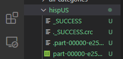

# Running the Program:
This project is split into 2 main parts: Data Ingestion and Data Analysis.

*   [Data Ingest](#data-Ingestion)
*   [Data Analysis](#data-analysis)

## Data Injestion
Packages needed:
```
pip install python-dotenv
pip install boto3
```
### Goals
1.  Programmatically download/unzip all zip files from census website urls by decade (2000, 2010, 2020)
2.  Gather summary rows from each state to generate 2 csv files for each decade (The second file will house data under the "Over 18" category)
3.  Upload generated csv files into a AWS S3 Bucket (Credentials should be in a .env file inside the root level of repo.)
    * Environment variable names: *ACCESS_KEY_ID, SECRET_ACCESS_KEY, BUCKET_NAME, REGION_NAME*

### Steps
* [Scraping Zip Files From URL](#web-crawler-python-script-for-US-Census-Redistricting-Data-2000/2010)
* [Ingesting 2000 Data](#ingesting-data-for-2000)
* [Ingesting 2010 Data](#ingesting-data-for-2010)
* [Injesting 2020 Data](#ingesting-data-for-2020)

## Web Crawler Python Script for US Census Redistricting Data 2000/2010

Location: Ingest_Data/web-scraper.py

```
 --change url depending on the year:
 ---2000: https://www2.census.gov/census_2000/datasets/redistricting_file--pl_94-171/
 ---2010: https://www2.census.gov/census_2010/redistricting_file--pl_94-171/
 ---2020: https://www2.census.gov/programs-surveys/decennial/2020/data/01-Redistricting_File--PL_94-171/

os.system('wget --no-directories --content-disposition -e robots=off -A.zip -r --no-parent -l 3 [url]')
```
1.  Navigate to the directory where zip files should be placed
2.  Run python3/python [path_to_repo_on_local_machine]/Ingest_Data/web-scraper.py
3.  The script will download every .zip file on the webpage onto the current directory

Example:

```
mkdir 2010_zipfiles
cd 2010_zipfiles
python3 /path/to/localmachine/repo/Ingest_Data/web-scraper.py
ls
```


## Ingesting Data for 2000

2000 Script Location: Ingest_Data/2000_ingest.py

1.  Set ```zip_directory ``` to reference the directory containing the zip files for 2000.

```
def main():
    zip_directory = '[path_to_zip_files_directory]'
```

2.  This program saves the two resulting .csv files to the current working directory (cwd)
    by default. If you need to upload these files to AWS S3 storage instead, change the
    variable ```upload_to_AWS``` to ```True```.

3.  Execute the python script

    From root level:
    ```
    python Ingest_Data/2000_ingest.py

    ```

3.  Executing the script will upload two .csv files (2000_1.csv and 2000_2.csv) to the cwd
    if ```upload_to_AWS``` is  ```False``` or into an S3 Bucket if it is ```True```.

## Ingesting Data for 2010

2010 Script Location: Ingest_Data/2010_ingest.py

1. Set ```directory ``` to reference the directory containing the zip files for 2010

```
def main():
    directory = '[path_to_zip_files_directory]'
```

2. Execute the python script

From root level:
```

python Ingest_Data/2010_ingest.py

```

3. Executing the script will upload two .csv files (2010_1.csv and 2010_2.csv) into an S3 Bucket

## Ingesting Data for 2020
Script Location: Ingest_Data/2020_ingest.py

2020_ingest.py showcases a different ingestion process from 2000/2010. The script incorporates a web-scraper functionality and processes the deletion of individual zip files after extraction. Also dynamic path creation negates the need for the user to manually insert a directory.

From root level:
```
python Ingest_Data/2020_ingest.py
```


## Data Analysis

### Goals
1. Determine what data is needed for each data analysis question.
    * Determine if any records are unnecessary and use filters to remove any such records.
    * Determine what columns (i.e. population data) are needed for each question.
2. Write queries to select the desired data for each data analysis question.
3. Use data visualization tools to produce charts, graphs, tables, etc. to visually present the data.

### Steps Below
* [Create SparkSession](#creating-the-sparksession)
* [Import, Filter, and Combine the Data](#importing-filtering-and-combining-the-data)
* [Query the Data](#querying-the-requested-data)
* [Create Data Visualizations](#creating-data-visualizations)

## Creating the SparkSession

Make sure that the PySpark module is installed on your system.

```
pip install pyspark
```

Import SparkSession from the pyspark.sql module.

```python
from pyspark.sql import SparkSession
```

Then use the SparkSession builder to create your SparkSession. Set the SparkContext variable as well.

```python
spark = SparkSession.builder \
    .master("local") \
    .appName("project3") \
    .getOrCreate()

sc = spark.sparkContext
sc.setLogLevel("WARN")

'''

<SPARK JOBS HERE>

'''

# DON'T FORGET TO STOP THE SPARKSESSION!!
spark.stop()
```

## Importing, Filtering, and Combining the Data

1. To query from the dataset, we must first import the data we want to use. Use the following code to do this for each census year:

```python
path = # LOCATION OF FILES ON YOUR LOCAL MACHINE

popdata20XX = spark.read \
    .option("header", True) \
    .option("inferSchema", True) \
    .csv(path + "20XX_1.csv")
```
NOTE: For 2020, the file convention is 'YYYY_P1.csv', rather than 'YYYY_1.csv'.

2. For the purposes of this project, we will not be including Puerto Rico in the national population data, nor will we be using the US national summary files or records. We will
filter out this data as follows:

```python
# ADD YEAR COLUMN TO EACH DATAFRAME TO DIFFERENTIATE BETWEEN CENSUS YEAR
# lit() FUNCTION CREATES COLUMN OF CONSTANT VALUES
from pyspark.sql.functions import lit

popdata20XX_raw.createOrReplaceTempView("popdata20XX_raw")
popdata20XX = spark.sql("SELECT * FROM popdata20XX_raw WHERE STUSAB != 'PR' AND STUSAB != 'US'") \
    .withColumn("Year", lit(20XX))
```

3. Finally, we must combine the data from each census into one DataFrame.

```python
popdata = popdata2000.union(popdata2010).union(popdata2020).repartition(1)
# BE SURE TO REPARTITION, OR SAVED DATAFRAMES WILL BE SEPARATED BY CENSUS YEAR
popdata.createOrReplaceTempView("popdata")
```

## Querying the Requested Data

For this example, we'll refer to the question of population of different racial/ethnic categories. For the full query code, refer to the categoryQueries python file
(Location: /query_data/byCategory/categoryQueries.py).  
  
Code for other queries are also available in the /query_data directory.  
  
Additionally, in this example, we'll use the spark.sql() function provided by pyspark to query results.

1. First, we want to query the sum totals for various categories that are provided to us in the dataset.  
The relevant categories will be:
    * Total Population (P0010001)
    * Population of One Race (P0010002)
    * White Alone (P0010003)
    * Black or African American Alone (P0010004)
    * American Indian or Alaska Native Alone (P0010005)
    * Asian Alone (P0010006)
    * Native Hawaiian or Pacific Islander Alone (P0010007)
    * Some Other Race Alone (P0010008)
    * Two or More Races (P0010009)
    * Hispanic of Any Race (P0020002)
    * Non-Hispanic of Any Race (P0020003)
    <br /><br />
2. The next step is to write the queries to provide our desired results, the sum totals of the relevant categories. We will do this in two queries for each table.
<br /><br />  

The first query will look like this in our code, grabbing the state-by-state totals of each category and creating a temporary view:
```python
spark.sql("SELECT Year, STUSAB AS State, P0010001 AS Total, P0010002 AS OneRace, P0010003 AS White, P0010004 AS Black, "
          "P0010005 AS NativeAm, P0010006 AS Asian, P0010007 AS PacIslander, P0010008 AS Other, P0010009 AS TwoOrMore, "
          "P0020002 AS Hispanic, P0020003 AS NonHispanic FROM popdata").createOrReplaceTempView("cat_1")
```

Then, from the temporary view, we will query the sums of each category by year.
```python
usData_1 = spark.sql("SELECT Year, SUM(Total) AS Total, SUM(OneRace) AS OneRace, SUM(White) AS White, SUM(Black) AS Black, "
                     "SUM(NativeAm) AS NativeAm, SUM(Asian) AS Asian, SUM(PacIslander) AS PacIslander, SUM(Other) AS Other, "
                     "SUM(TwoOrMore) AS TwoOrMore, SUM(Hispanic) AS Hispanic, SUM(NonHispanic) AS NonHispanic FROM cat_1 "
                     "GROUP BY Year")
```

For this query, we wanted to look at these categories from all angles, so there were various tables we decided to query.
```python
    # --------------- usData_2 (Non-Hispanic Totals for all categories, Hispanic as separate category) --------------- #
spark.sql("SELECT Year, STUSAB AS State, P0010001 AS Total, P0020002 AS Hispanic, P0020005 AS White, P0020006 AS Black, P0020007 AS NativeAm, "
          "P0020008 AS Asian, P0020009 AS PacIslander, P0020010 AS Other, P0020011 AS TwoOrMore FROM popdata") \
          .createOrReplaceTempView("cat_2")

usData_2 = spark.sql("SELECT Year, SUM(Total) AS Total, SUM(Hispanic) AS Hispanic, SUM(White) AS White, SUM(Black) AS Black, SUM(NativeAm) AS NativeAm, "
                     "SUM(Asian) AS Asian, SUM(PacIslander) AS PacIslander, SUM(Other) AS Other, SUM(TwoOrMore) AS TwoOrMore FROM cat_2 "
                     "GROUP BY Year")

    # --------------- hispUS (Hispanic Totals for all categories) --------------- #
spark.sql("SELECT Year, STUSAB AS State, P0020002 AS Total, P0010002-P0020004 AS OneRace, P0010003-P0020005 AS White, P0010004-P0020006 AS Black, "
          "P0010005-P0020007 AS NativeAm, P0010006-P0020008 AS Asian, P0010007-P0020009 AS PacIslander, P0010008-P0020010 AS Other, "
          "P0010009-P0020011 AS TwoOrMore FROM popdata ORDER BY Total DESC").createOrReplaceTempView("hisp")

hispUS = spark.sql("SELECT Year, SUM(Total) AS Total, SUM(OneRace) AS OneRace, SUM(White) AS White, SUM(Black) AS Black, SUM(NativeAm) AS NativeAm, "
                   "SUM(Asian) AS Asian, SUM(PacIslander) AS PacIslander, SUM(Other) AS Other, SUM(TwoOrMore) AS TwoOrMore FROM hisp "
                   "GROUP BY Year")

    # --------------- nonhispUS (Non-Hispanic Totals for all categories) --------------- #
spark.sql("SELECT Year, STUSAB AS State, P0020003 AS Total, P0020004 AS OneRace, P0020005 AS White, P0020006 AS Black, P0020007 AS NativeAm, "
          "P0020008 AS Asian, P0020009 AS PacIslander, P0020010 AS Other, P0020011 AS TwoOrMore FROM popdata ORDER BY Total DESC") \
          .createOrReplaceTempView("nonhisp")

nonhispUS = spark.sql("SELECT Year, SUM(Total) AS Total, SUM(OneRace) AS OneRace, SUM(White) AS White, SUM(Black) AS Black, SUM(NativeAm) AS NativeAm, "
                      "SUM(Asian) AS Asian, SUM(PacIslander) AS PacIslander, SUM(Other) AS Other, SUM(TwoOrMore) AS TwoOrMore FROM nonhisp "
                      "GROUP BY Year")
```

2. To verify that you have your desired DataFrame, simply call the show function.
```python
usData_1.show()
```

3. Now that we have our desired DataFrames, we can use the DataFrame.write function to save them to CSV files.
```python
savepath = # FILEPATH YOU WANT TO SAVE TO
usData_1.write.csv(savepath + "usData_1", header=True)
```
This function will create a CSV file for each partition in the DataFrame and save it to a directory entitle "usData_1". In this case, we have one partition, so there should only be one CSV files. The remaining files are not important for our project, so they can be discarded.

4. Submit the program as a spark job using the ```spark-submit``` command within the Ubuntu terminal.
```
spark-submit categoryQueries.py
```
As a result, you should see a new folder in your specified directory containing 4 files.
<br />


You can rename the part-00000[...].csv file for convenience when creating data visualizations.

## Creating Data Visualizations
<!--UNDER CONSTRUCTION-->