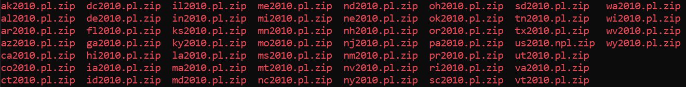

# Running the Program:

## Data Injestion

### Goals:
    - Programmatically download/unzip all zip files from census website by decade (2000, 2010, 2020)
    - Gather summary rows from each state to generate 2 csv files for each decade (The second file will house data under the "Over 18" category)
    - Upload generated csv files into a AWS S3 Bucket
### Steps Below:
* [Scraping Zip Files From URL](#web-crawler-python-script-for-US-Census-Redistricting-Data-2000/2010)
* [Ingesting 2000 Data](#ingesting-data-for-the-year-2000)
* [Ingesting 2010 Data](#features)
* [Injesting 2020 Data](#screenshots)

## Data Analysis

### Goals:
    - Placeholder goal
### Steps Below: 
* [Table of content item placeholder](#placeholder-link)

## Web Crawler Python Script for US Census Redistricting Data 2000/2010

Location: Ingest_Data/main.py

```
 --change url depending on the year:
 ---2000: https://www2.census.gov/census_2000/datasets/redistricting_file--pl_94-171/
 ---2010: https://www2.census.gov/census_2010/redistricting_file--pl_94-171/
 ---2020: https://www2.census.gov/programs-surveys/decennial/2020/data/01-Redistricting_File--PL_94-171/

os.system('wget --no-directories --content-disposition -e robots=off -A.zip -r --no-parent -l 3 [url]')
```
1. Navigate to the directory where zip files should be placed
2. Run python3/python [path_to_repo_on_local_machine]/Ingest_Data/main.py
3. The script will download every .zip file on the webpage onto the current directory

Example:

```
mkdir 2010_zipfiles
cd 2010_zipfiles
python3 /path/to/localmachine/repo/Ingest_Data/main.py
ls
```


## Ingesting Data for the year 2000


