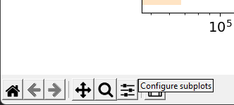

# Running the Program:
This project is split into 2 main parts: Data Ingestion and Data Analysis.

*   [Data Ingest](#data-Ingestion)
*   [Data Analysis](#data-analysis)

# Data Ingestion
Packages needed:
```
pip install python-dotenv
pip install boto3
```
### Goals
1.  Programmatically download/unzip all zip files from census website urls by decade (2000, 2010, 2020)
2.  Gather summary rows from each state to generate 2 csv files for each decade (The second file will house data under the "Over 18" category)
3.  Upload generated csv files into a AWS S3 Bucket (Credentials should be in a .env file inside the root level of repo.)
    * Environment variable names: *ACCESS_KEY_ID, SECRET_ACCESS_KEY, BUCKET_NAME, REGION_NAME*

### Steps
* [Scraping Zip Files From URL](#web-crawler-python-script-for-US-Census-Redistricting-Data-2000/2010)
* [Ingesting 2000 Data](#ingesting-data-for-2000)
* [Ingesting 2010 Data](#ingesting-data-for-2010)
* [Ingesting 2020 Data](#ingesting-data-for-2020)

## Web Crawler Python Script for US Census Redistricting Data 2000/2010

Location: Ingest_Data/web-scraper.py

```
 --change url depending on the year:
 ---2000: https://www2.census.gov/census_2000/datasets/redistricting_file--pl_94-171/
 ---2010: https://www2.census.gov/census_2010/redistricting_file--pl_94-171/
 ---2020: https://www2.census.gov/programs-surveys/decennial/2020/data/01-Redistricting_File--PL_94-171/

os.system('wget --no-directories --content-disposition -e robots=off -A.zip -r --no-parent -l 3 [url]')
```
1.  Navigate to the directory where zip files should be placed
2.  Run python3/python [path_to_repo_on_local_machine]/Ingest_Data/web-scraper.py
3.  The script will download every .zip file on the webpage onto the current directory

Example:

```
mkdir 2010_zipfiles
cd 2010_zipfiles
python3 /path/to/localmachine/repo/Ingest_Data/web-scraper.py
ls
```


## Ingesting Data for 2000

2000 Script Location: Ingest_Data/2000_ingest.py

1.  Set ```zip_directory ``` to reference the directory containing the zip files for 2000.

```
def main():
    zip_directory = '[path_to_zip_files_directory]'
```

2.  This program saves the two resulting .csv files to the current working directory (cwd)
    by default. If you need to upload these files to AWS S3 storage instead, change the
    variable ```upload_to_AWS``` to ```True```.

3.  Execute the python script

    From root level:
    ```
    python Ingest_Data/2000_ingest.py

    ```

3.  Executing the script will upload two .csv files (2000_1.csv and 2000_2.csv) to the cwd
    if ```upload_to_AWS``` is  ```False``` or into an S3 Bucket if it is ```True```.

## Ingesting Data for 2010

2010 Script Location: Ingest_Data/2010_ingest.py

1. Set ```directory ``` to reference the directory containing the zip files for 2010

```
def main():
    directory = '[path_to_zip_files_directory]'
```

2. Execute the python script

From root level:
```

python Ingest_Data/2010_ingest.py

```

3. Executing the script will upload two .csv files (2010_1.csv and 2010_2.csv) into an S3 Bucket

## Ingesting Data for 2020
Script Location: Ingest_Data/2020_ingest.py

2020_ingest.py showcases a different ingestion process from 2000/2010. The script incorporates a web-scraper functionality and processes the deletion of individual zip files after extraction. Also dynamic path creation negates the need for the user to manually insert a directory.

From root level:
```
python Ingest_Data/2020_ingest.py
```


# Data Analysis
<!--UNDER CONSTRUCTION-->

### Goals
1. Determine what data is needed for each data analysis question.
    * Determine if any records are unnecessary and use filters to remove any such records.
    * Determine what columns (i.e. population data) are needed for each question.
2. Write queries to select the desired data for each data analysis question.
3. Use data visualization tools to produce charts, graphs, tables, etc. to visually present the data.

### Steps
* [Create SparkSession](#creating-the-sparksession)
* [Import, Filter, and Combine the Data](#importing-filtering-and-combining-the-data)
* [Query the Data](#querying-the-requested-data)
* [Create Data Visualizations](#creating-data-visualizations)
    * [Tableau](#creating-visualizations-in-tableau)
    * [Python](#creating-visualizations-in-python)

## Creating the SparkSession

Make sure that the PySpark module is installed on your system.

```
pip install pyspark
```

Import SparkSession from the pyspark.sql module.

```python
from pyspark.sql import SparkSession
```

Then use the SparkSession builder to create your SparkSession. Set the SparkContext variable as well.

```python
spark = SparkSession.builder \
    .master("local") \
    .appName("project3") \
    .getOrCreate()

sc = spark.sparkContext
sc.setLogLevel("WARN")

'''

<SPARK JOBS HERE>

'''

# DON'T FORGET TO STOP THE SPARKSESSION!!
spark.stop()
```

## Importing, Filtering, and Combining the Data

1. To query from the dataset, we must first import the data we want to use. Use the following code to do this for each census year:

```python
path = # LOCATION OF FILES ON YOUR LOCAL MACHINE

popdata20XX = spark.read \
    .option("header", True) \
    .option("inferSchema", True) \
    .csv(path + "20XX_1.csv")
```
NOTE: For 2020, the file convention is 'YYYY_P1.csv', rather than 'YYYY_1.csv'.

2. For the purposes of this project, we will not be including Puerto Rico in the national population data, nor will we be using the US national summary files or records. We will
filter out this data as follows:

```python
# ADD YEAR COLUMN TO EACH DATAFRAME TO DIFFERENTIATE BETWEEN CENSUS YEAR
# lit() FUNCTION CREATES COLUMN OF CONSTANT VALUES
from pyspark.sql.functions import lit

popdata20XX_raw.createOrReplaceTempView("popdata20XX_raw")
popdata20XX = spark.sql("SELECT * FROM popdata20XX_raw WHERE STUSAB != 'PR' AND STUSAB != 'US'") \
    .withColumn("Year", lit(20XX))
```

3. Finally, we must combine the data from each census into one DataFrame.

```python
popdata = popdata2000.union(popdata2010).union(popdata2020).repartition(1)
# BE SURE TO REPARTITION, OR SAVED DATAFRAMES WILL BE SEPARATED BY CENSUS YEAR
popdata.createOrReplaceTempView("popdata")
```

## Querying the Requested Data

For this example, we'll refer to the question of population of different racial/ethnic categories. For the full query code, refer to the [categoryQueries](query_data/byCategory/categoryQueries.py) python file. Code for other queries is also available in the [query_data](query_data) directory.  
  
Additionally, in this example, we'll use the spark.sql() function provided by pyspark to query results.

1. First, you to determine what columns you need to pull from the dataset.  
The relevant columns in our case were:
    * Total Population (P0010001)
    * Population of One Race (P0010002)
    * White Alone (P0010003)
    * Black or African American Alone (P0010004)
    * American Indian or Alaska Native Alone (P0010005)
    * Asian Alone (P0010006)
    * Native Hawaiian or Pacific Islander Alone (P0010007)
    * Some Other Race Alone (P0010008)
    * Two or More Races (P0010009)
    * Hispanic of Any Race (P0020002)
    * Non-Hispanic of Any Race (P0020003)  
<br />
2. The next step is to write the queries to provide our desired results, the sum totals of the relevant categories. We did this in two queries for each table.
<br /><br />  

The first query looked like this in our code, grabbing the state-by-state totals of each category and creating a temporary view.
```python
spark.sql("SELECT Year, STUSAB AS State, P0010001 AS Total, P0010002 AS OneRace, P0010003 AS White, P0010004 AS Black, "
          "P0010005 AS NativeAm, P0010006 AS Asian, P0010007 AS PacIslander, P0010008 AS Other, P0010009 AS TwoOrMore, "
          "P0020002 AS Hispanic, P0020003 AS NonHispanic FROM popdata").createOrReplaceTempView("cat_1")
```

Then, from the temporary view, we queried the sums of each category by year.

```python
usData_1 = spark.sql("SELECT Year, SUM(Total) AS Total, SUM(OneRace) AS OneRace, SUM(White) AS White, SUM(Black) AS Black, "
                     "SUM(NativeAm) AS NativeAm, SUM(Asian) AS Asian, SUM(PacIslander) AS PacIslander, SUM(Other) AS Other, "
                     "SUM(TwoOrMore) AS TwoOrMore, SUM(Hispanic) AS Hispanic, SUM(NonHispanic) AS NonHispanic FROM cat_1 "
                     "GROUP BY Year")
```

To verify that you have your desired DataFrame, simply call the show function.

```python
usData_1.show()
```
<br />

3. If you have your desired DataFrames, you can use the DataFrame.write.csv function to save them to CSV files.
```python
savepath = # FILEPATH YOU WANT TO SAVE TO
usData_1.write.csv(savepath + "usData_1", header=True)
```
This function will create a CSV file for each partition in the DataFrame and save it to a directory entitled "usData_1". In this case, we have one partition, so there should only be one CSV files. The remaining files are not important for our project, so they can be discarded.
<br /><br />

4. Submit the program as a spark job using the ```spark-submit``` command within the Ubuntu terminal.
```
spark-submit categoryQueries.py
```
As a result, you should see a new folder in your specified directory containing 4 files.
<br />


You can rename the part-00000[...].csv file for convenience when creating data visualizations.
<br /><br />
## Creating Data Visualizations

Our team utilized the Tableau Public software, as well as the matplotlib and pandas python modules for constructing visualizations.

### Creating Visualizations in Tableau
1. Navigate to the [Tableau Public website](https://public.tableau.com/app/discover) and select Web Authoring under the Create menu to create a new Tableau workbook. Make sure you are logged in to a Tableau account. If you do not have an account, you will be prompted to create one.
<br /><br />

<br /><br />

2. Upload your data to the Tableau workbook. You can either open a selection window to choose your file or drag and drop your file from an open folder.
<br /><br />

<br /><br />
Once it's uploaded, create an extract of your data. This may take a moment to complete.
<br /><br />

<br /><br />

3. Open a worksheet (Sheet 1 is created by default). Drag your column data ("Year" in our case) from the left panel to the columns box, then drag your row or field data ("Population" in our case) to the rows box. You'll see the visualizations being created as you add data elements to the plot.
<br /><br />


<br /><br />
In this case, the data needs to be split by row (State), so we drag the "State" data from the left panel to the color button inside the Marks panel.
<br /><br />


<br /><br />

4. Make any alterations to the data you need. You can enable labels and other features by utilizing the Marks panel. You can filter data by a desired parameter by dragging data from the left panel into the Filter panel, then choosing how you want to filter.
<br /><br />

<br /><br />
You can also modify some of the elements of the graph directly.
<br /><br />


<br /><br />

5. Open a new dashboard. This is where you will be setting up your graph to be saved and used in your presentation.
<br /><br />

<br /><br />
Drag your worksheet from the panel on the left and drop it into the large blank area.
<br /><br />

<br /><br />
Your graph from before will now be shown, in much better form than before. You can make further edits here if necessary, and you can always return to the worksheet if you need to make any changes to the data.
<br /><br />

<br /><br />
If you need to, you can adjust the size of the dashboard. The final image pixel resolution matches the resolution specified here.
<br /><br />

<br /><br />

6. Finally, when you are satisfied with your visualization, click the download button and select "Image" to save the data visualization to your system.
<br /><br />

<br /><br />

### Creating Visualizations In Python
Before making visualizations in Python using matplotlib and pandas DataFrames, make sure you have these modules installed:
```
pip install pandas
pip install matplotlib
```

One these are installed, you can begin working on your code.

1. In order to begin creating visualizations, you need to import the necessary modules.
```python
import pandas as pd
import matplotlib.pyplot as plt
import matplotlib
```

2. Next, set up your DataFrames using pandas. You'll need to specify the filepath if you need to load from a file.
```python
## TO CREATE MANUALLY
# create a dictionary with your data (columns = keys, data = rows)
d = {'A':[1, 2, 3], 'B': [2, 3, 4], 'C': [3, 4, 5]}
df = pd.DataFrame(data=d)
# you can also set your own index values
idx = [0, 1, 2]
df = pd.DataFrame(data=d, index=idx)

## TO LOAD FROM FILE
file = # PATH TO FILE

# DEFAULT READ FUNCTION
df = pd.read_csv(file)

# TO SET THE INDEX TO A COLUMN IN THE DATA
df = pd.read_csv(file, index_col="COLUMN NAME")
```
There are also various functions you can call on pandas DataFrames to modify them to your needs.
```python
# TO SELECT SPECIFIC COLUMNS
df1 = df[[LIST OF COLUMN NAMES]]

# TO CHANGE COLUMN NAMES
df.columns = [LIST OF NEW COLUMN NAMES]

# TO TURN ROWS INTO COLUMNS, VICE VERSA
df1 = df.transpose()

# TO SORT A DATAFRAME BY A COLUMN
df.sort_values(by="COLUMN NAME", inplace=True)
# ascending order by default, set ascending=False to sort in descending order
df.sort_values(by="COLUMN NAME", inplace=True, ascending=False)

# TO CREATE A NEW COLUMN FROM OTHER COLUMNS
# write an operation using the names of the columns you want to use
df.eval("DESIRED OPERATION", inplace=True)

# TO JOIN MULTIPLE DATAFRAMES
df3 = df1.join(df2, on="ON CONDITION")
# you can omit the on parameter if you want to join on the index parameters
# otherwise, use the on parameter to set the on condition

# TO UNION DATA FROM MULTIPLE DATAFRAMES
df3 = df1.union(df2)
```

If more methods are needed, refer to the Pandas DataFrame [documentation](https://pandas.pydata.org/docs/reference/frame.html).

3. You're now ready to make graphs. This will be done using the DataFrame.plot() function.
```python
ax = df.plot()
```
By default, matplotlib will create a line graph if not plot type is specified (Refer to [documentation](https://pandas.pydata.org/docs/reference/api/pandas.DataFrame.plot.html#pandas.DataFrame.plot) for list of plot types.
```python
# TWO WAYS TO SPECIFY PLOT TYPE

# 1) kind parameter
ax = df.plot(kind="PLOT_TYPE")

# 2) kind method
ax = df.plot.PLOT_TYPE()
```

For more guidance on specific methods and functions, refer to the official documentation from [Pandas](https://pandas.pydata.org/docs/reference/api/pandas.DataFrame.plot.html#pandas.DataFrame.plot) and from [matplotlib](https://matplotlib.org/stable/api/_as_gen/matplotlib.pyplot.html). For concrete examples from this project (pie charts and bar graphs), refer to the [data_vis](query_data/byCategory/all-categories/data_vis.py) python file.

4. In order to show the graphs, you must call the show() function.
```python
plt.show()
```

This will bring up a window displaying your graph, as well as some options in the bottom left corner.




You can edit the size of the graph using the subplot configuration settings.


When you are satisfied with your visualization, click the save icon, choose a file location, and save it.
